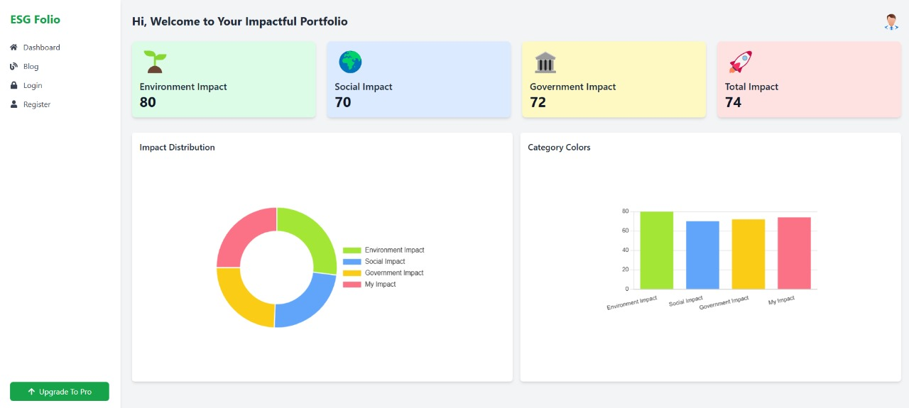

# Green Finance Optimization Platform

## Overview

The Green Finance Optimization Platform is an AI-powered system designed to help financial institutions assess, prioritize, and optimize green finance investments. By evaluating projects based on ESG (Environmental, Social, and Governance) impact, predicting ROI, and using optimization techniques, the platform enables banks and financial institutions to allocate resources effectively and maximize sustainability outcomes.

This platform uses a combination of **Natural Language Processing (NLP)**, **Logistic Regression**, **Linear Programming**, and **Mixed-Integer Programming** to predict ESG scores, ROI, and optimize green investment portfolios.

## Table of Contents

- [Features](#features)
- [Tech Stack](#tech-stack)
- [Installation](#installation)
- [Usage](#usage)
- [Workflow](#workflow)
- [Contributors](#contributors)
- [License](#license)

## Features

- **ESG Prediction**: Uses a logistic regression model trained on ESG data to predict the sustainability impact of various projects.
- **ROI Prediction**: Predicts the return on investment (ROI) for different green finance projects.
- **Investment Optimization**: Applies Linear Programming (LP) and Mixed-Integer Programming (MIP) to optimize green finance portfolios.
- **Scenario Analysis**: Allows financial institutions to evaluate different investment strategies and their impact on ROI, ESG scores, and risk.
- **Dashboard**: Provides a user-friendly interface for stakeholders to visualize the results of investment optimizations.

## Tech Stack

- **Backend**: Python, Flask
- **Machine Learning**: Scikit-learn, Logistic Regression, Natural Language Processing (NLP)
- **Optimization**: Linear Programming (LP), Mixed-Integer Programming (MIP)
- **Frontend**: React, Tailwind CSS
- **APIs**: Hugging Face Transformers (for NLP models)

## Installation

1. Clone the repository:

   ```bash
   git clone https://github.com/yourusername/green-finance-optimization.git
   cd green-finance-optimization
   ```

2. Create and activate a virtual environment:

   ```bash
   python3 -m venv venv
   source venv/bin/activate  # On Windows use `venv\Scripts\activate`
   ```

3. Install required dependencies:

   ```bash
   pip install -r requirements.txt
   ```

4. Run the Flask backend server:

   ```bash
   python app.py
   ```

5. Run the frontend React app:
   ```bash
   cd frontend
   npm install
   npm start
   ```

## Usage

Once the platform is running, users can upload project reports (in PDF format) to evaluate their ESG impact, predict ROI, and see investment optimization results. The system uses NLP to extract relevant information from the reports and then applies logistic regression for ESG and ROI prediction.

## Workflow

The following flowchart illustrates the steps in the platform's workflow:

1. **PDF Extraction**: Project reports in PDF format are uploaded to the system.
2. **NLP Extraction**: Natural Language Processing is used to extract relevant data (such as project goals, ESG initiatives, financials) from the reports.
3. **Logistic Regression Model for ESG Prediction**: The extracted data is used in a logistic regression model to predict ESG scores based on predefined environmental, social, and governance criteria.
4. **ROI Prediction**: A model predicts the return on investment (ROI) for each project, considering factors like financial health, market trends, and past project performance.
5. **Investment Optimization**: Linear Programming (LP) and Mixed-Integer Programming (MIP) are applied to optimize investments across different projects, aiming to maximize ESG impact while respecting constraints like budget and risk.

## Usage

Once the platform is running, users can upload project reports (in PDF format) to evaluate their ESG impact, predict ROI, and see investment optimization results. The system uses NLP to extract relevant information from the reports and then applies logistic regression for ESG and ROI prediction.

Below is an example of the platform's user interface:



## Contributors

- [Rahul Kumar](https://github.com/rahulkr3201)
- [Contributor 1 Name](https://github.com/contributor1)
- [Contributor 2 Name](https://github.com/contributor2)

## License

This project is licensed under the MIT License - see the [LICENSE](LICENSE) file for details.
